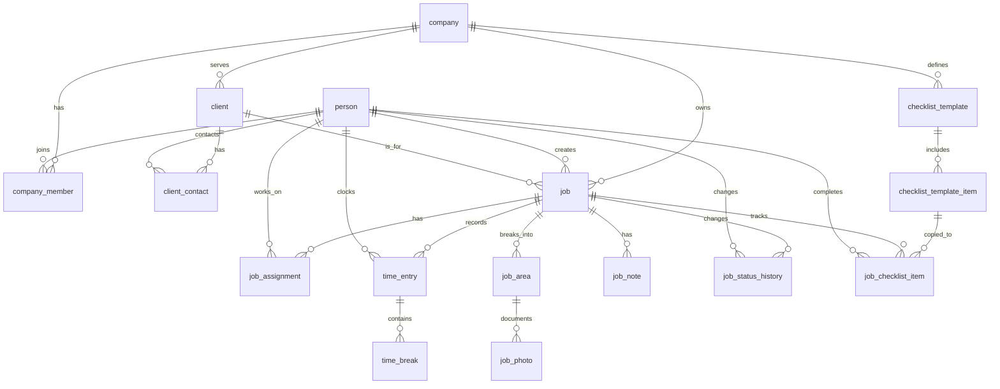

# VisionPaint Schema Draft

This is the working PostgreSQL schema for VisionPaint. It is intentionally centered on the two tables that already exist in Supabase, `person` and `job`, and expands outward from there.

## Design goals

- Keep the current app simple to work with now.
- Preserve history for jobs, time, photos, and notes.
- Support painting-specific workflows without forcing the app into a rigid enterprise shape.
- Keep the schema relational so Supabase can infer joins cleanly.

## Assumptions

- We are treating the app as multi-company capable, even if we only use one company at first.
- `person` is a shared human record. A person can be an employee, a client, or both.
- `person` is a shared human record. A person can be an employee, a client contact, or both.
- `job` stays the central project table.
- Integer primary keys are kept for the core tables so the current API can evolve without an immediate type rewrite.
- People are meant to be deactivated, not hard-deleted, so historical data stays intact.

## Core tables

### `company`
The tenant / contractor account.

Fields:
- `id`
- `name`
- `timezone`
- `language_code`
- `created_at`
- `updated_at`

### `person`
The shared human directory.

Fields:
- `id`
- `auth_user_id`
- `name`
- `email`
- `phone`
- `is_active`
- `created_at`
- `updated_at`

### `company_member`
Links people to companies and stores their access role.

Fields:
- `company_id`
- `person_id`
- `role`
- `status`
- `invited_at`
- `joined_at`

### `client`
The customer account for a job, usually a homeowner or property owner organization.

Fields:
- `id`
- `company_id`
- `name`
- `billing_email`
- `phone`
- `address_line1`
- `address_line2`
- `city`
- `state_region`
- `postal_code`
- `country_code`
- `is_active`
- `created_at`
- `updated_at`

### `client_contact`
Links people to a client account so the same person can also be an employee, an internal user, or both.

Fields:
- `client_id`
- `person_id`
- `role`
- `is_primary`
- `created_at`

This is what lets one human stay in a single `person` row and still participate in both the contractor side and the client side of the business.

## Job workflow tables

### `job`
The main project record.

Fields:
- `id`
- `company_id`
- `client_id`
- `created_by_person_id`
- `title`
- `description`
- `status`
- `priority`
- `address_line1`
- `address_line2`
- `city`
- `state_region`
- `postal_code`
- `country_code`
- `scheduled_start_at`
- `scheduled_end_at`
- `due_at`
- `started_at`
- `completed_at`
- `closed_at`
- `created_at`
- `updated_at`

### `job_assignment`
Many-to-many bridge between jobs and workers.

Fields:
- `job_id`
- `person_id`
- `assignment_role`
- `assigned_at`
- `unassigned_at`

### `time_entry`
Clock-in / clock-out records tied to a person and a job.

Fields:
- `id`
- `job_id`
- `person_id`
- `clock_in_at`
- `clock_out_at`
- `break_minutes`
- `notes`
- `created_at`
- `updated_at`

### `time_break`
Breaks attached to a time entry.

Fields:
- `id`
- `time_entry_id`
- `break_start_at`
- `break_end_at`
- `break_type`
- `notes`

### `job_note`
Short updates and comments on a job.

Fields:
- `id`
- `job_id`
- `author_person_id`
- `note`
- `created_at`

### `job_status_history`
Tracks every job status change over time.

Fields:
- `id`
- `job_id`
- `from_status`
- `to_status`
- `changed_by_person_id`
- `changed_at`
- `reason`
- `notes`

## Painting-specific tables

### `job_area`
Room-by-room or area-by-area progress tracking.

Fields:
- `id`
- `job_id`
- `parent_job_area_id`
- `name`
- `status`
- `sort_order`
- `notes`
- `started_at`
- `completed_at`

### `job_photo`
Before / after / progress photo timeline.

Fields:
- `id`
- `job_id`
- `job_area_id`
- `job_status`
- `uploaded_by_person_id`
- `photo_kind`
- `storage_path`
- `caption`
- `taken_at`
- `created_at`

### `checklist_template`
Reusable surface-prep checklist templates.

Fields:
- `id`
- `company_id`
- `name`
- `is_default`
- `created_at`
- `updated_at`

### `checklist_template_item`
Items inside a checklist template.

Fields:
- `id`
- `checklist_template_id`
- `title`
- `sort_order`
- `is_required`

### `job_checklist_item`
Job-level checklist completion state copied from a template item.

Fields:
- `job_id`
- `template_item_id`
- `status`
- `completed_by_person_id`
- `completed_at`
- `notes`

## Relationship map

## What this gives us

- Job assignment history without stuffing arrays into `job`.
- Time tracking that can grow into real payroll-ready data later.
- A clean home for job photos and room progress.
- A reusable checklist structure that fits painting workflows.
- A path for client intake later without redesigning the core tables.

## Security note

Because this is a Supabase-backed database, the next pass should add RLS policies for any table exposed through the `public` schema. The schema draft is the data model first; access rules come right after.

## Next step

Once we agree on this shape, the next pass should be the actual migration SQL and then the backend model update so the API and database line up again.
