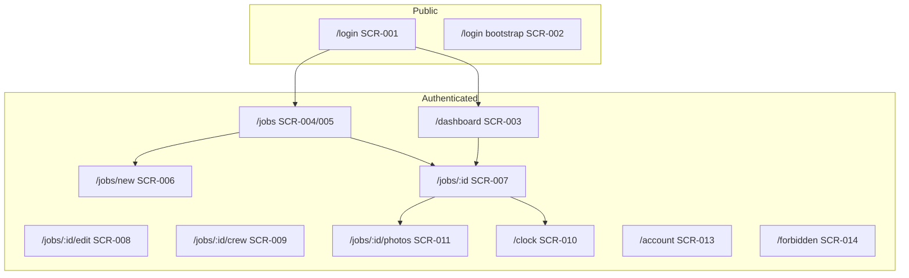

# VisionPaint Screen Map

MVP screen inventory for CSE 499A Week 4–8. Routes are **planned** frontend paths; implement with Vue Router(or equivalent) when the app shell is split.

## Legend

| Priority | Meaning                                        |
| -------- | ---------------------------------------------- |
| P0       | Required for MVP / Week 8 prototype demo       |
| P1       | Strongly desired for 499B; can ship after demo |
| P2       | Stretch (schema supports; UI deferred)         |

## Roles

| Role      | Typical user   | Default home            |
| --------- | -------------- | ----------------------- |
| `owner`   | Business owner | `/dashboard`            |
| `admin`   | Office admin   | `/dashboard`            |
| `manager` | Lead / foreman | `/dashboard` or `/jobs` |
| `crew`    | Field painter  | `/jobs` (assigned only) |

Authorization rules: [auth design](../superpowers/specs/2026-05-07-auth-design.md).

---

## Screen inventory

| ID      | Screen                     | Route                  | Roles                 | Priority | API (current / planned)                       |
| ------- | -------------------------- | ---------------------- | --------------------- | -------- | --------------------------------------------- |
| SCR-001 | Sign in                    | `/login`               | all (guest)           | P0       | `POST /api/auth/login`                        |
| SCR-002 | First-time bootstrap       | `/login?bootstrap=1`   | guest (once)          | P0       | `POST /api/auth/bootstrap`                    |
| SCR-003 | Manager dashboard          | `/dashboard`           | owner, admin, manager | P0       | jobs aggregate, hours (planned)               |
| SCR-004 | Jobs list (all company)    | `/jobs`                | owner, admin, manager | P0       | `GET /api/jobs`                               |
| SCR-005 | Jobs list (my assignments) | `/jobs`                | crew                  | P0       | `GET /api/jobs` + assignment filter (planned) |
| SCR-006 | Create job                 | `/jobs/new`            | owner, admin, manager | P0       | `POST /api/jobs`                              |
| SCR-007 | Job detail                 | `/jobs/:id`            | all (scoped)          | P0       | `GET /api/jobs/:id`                           |
| SCR-008 | Edit job                   | `/jobs/:id/edit`       | owner, admin, manager | P1       | `PUT /api/jobs/:id`                           |
| SCR-009 | Assign crew                | `/jobs/:id/crew`       | owner, admin, manager | P1       | `job_assignment` API (planned)                |
| SCR-010 | Clock (hub)                | `/clock`               | all                   | P0       | `time_entry` API (planned)                    |
| SCR-011 | Photo timeline             | `/jobs/:id/photos`     | assigned + managers   | P0       | `job_photo` + storage (planned)               |
| SCR-012 | Upload photo               | `/jobs/:id/photos/new` | assigned + managers   | P0       | storage upload (planned)                      |
| SCR-013 | Account                    | `/account`             | all authenticated     | P1       | `GET /api/auth/status`                        |
| SCR-014 | Access denied              | `/forbidden`           | all                   | P0       | —                                             |
| SCR-015 | Job areas (rooms)          | `/jobs/:id/areas`      | manager+              | P2       | `job_area` (schema only)                      |
| SCR-016 | Checklists                 | `/jobs/:id/checklist`  | manager+              | P2       | `job_checklist_item` (schema only)            |
| SCR-017 | Users admin                | `/users`               | owner, admin          | P1       | `GET/POST/PATCH /api/users`                   |

---

## Navigation shells

### Crew mobile (`owner` not using field mode — default for `crew`)

Bottom navigation (max 4 items):

| Tab     | Route      | Screen IDs         |
| ------- | ---------- | ------------------ |
| Jobs    | `/jobs`    | SCR-005, → SCR-007 |
| Clock   | `/clock`   | SCR-010            |
| Account | `/account` | SCR-013            |

Photos are reached from **Job detail** (SCR-007 → SCR-011), not a top-level tab, to avoid duplicate entry points.

### Manager / owner (`owner`, `admin`, `manager`)

| Context           | Navigation                                                        |
| ----------------- | ----------------------------------------------------------------- |
| Mobile            | Bottom nav: Dashboard, Jobs, Clock (optional), Account            |
| Desktop (≥1024px) | Left sidebar: Dashboard, Jobs, Account; content max-width ~1120px |

`crew` users who are also `manager` use the **highest-privilege** shell for their company role (manager shell).

---

## Job status vocabulary

Aligned with [JobsController](../../backend/Controllers/JobsController.cs):

| Status        | UI label    | Typical next states        |
| ------------- | ----------- | -------------------------- |
| `scheduled`   | Scheduled   | `in_progress`, `cancelled` |
| `in_progress` | In progress | `completed`, `cancelled`   |
| `completed`   | Completed   | — (archive / close later)  |
| `cancelled`   | Cancelled   | —                          |

Priority: `low` | `normal` | `high` | `urgent`.

---

## Route tree (MVP)

---

## Stakeholder question mapping

Use [StakeHolderQuestions.md](../../StakeHolderQuestions.md) in Week 5 meetings. Screens that answer each area:

| Topic                 | Screens to demo                   |
| --------------------- | --------------------------------- |
| Workflow / admin pain | SCR-003, SCR-004, SCR-006         |
| Employee / hours      | SCR-010, SCR-007 (time section)   |
| Photos                | SCR-011, SCR-012                  |
| Project tracking      | SCR-007, SCR-004 (status filters) |
| Mobile usage          | SCR-005, SCR-010 wireframes       |

---

## Wireframes

All P0 screens: [wireframes/index.html](./wireframes/index.html)

## Implementation phases

| Phase | Weeks   | Screens                                       |
| ----- | ------- | --------------------------------------------- |
| A     | 4–5     | Spec + wireframes + stakeholder sign-off (done) |
| B     | 7–8     | SCR-001–007, SCR-010 (basic), shell + routing |
| C     | 9–11    | SCR-009–012, SCR-003 metrics                  |
| D     | 499B    | Polish, SCR-013, responsive pass              |
