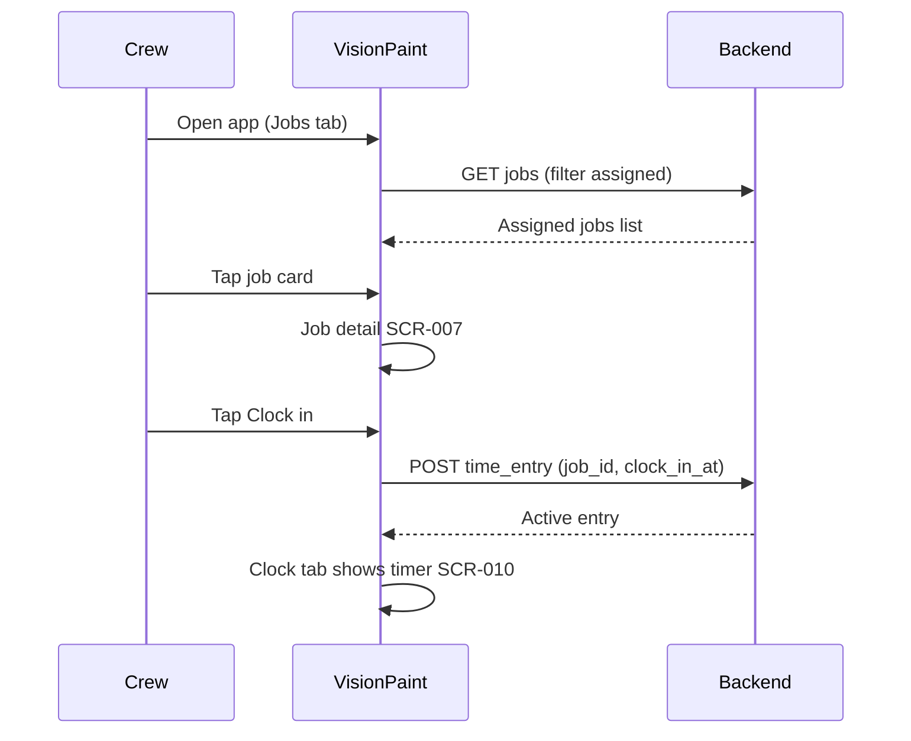
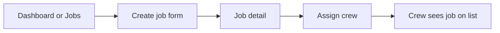

# VisionPaint User Journeys

End-to-end workflows for **Week 5 stakeholder validation**. Each journey lists actors, preconditions, happy path, failure/alternate paths, and screens ([screen-map.md](./screen-map.md)).

---

## J1 — Crew clocks in on an assigned job

**Actor:** `crew`  
**Goal:** Start paid time on the correct job with minimal taps.  
**Stakeholder themes:** Employee management, mobile usage.

### Preconditions

- User is signed in.
- User is assigned to at least one job in `scheduled` or `in_progress` status.
- User is not already clocked in (no open `time_entry`).

### Happy path

| Step | Action | Screen |
|------|--------|--------|
| 1 | Open app | SCR-005 |
| 2 | Select assigned job | SCR-007 |
| 3 | Tap **Clock in** | SCR-007 or SCR-010 |
| 4 | See active timer and job name | SCR-010 |

### Alternates

| Situation | UX |
|-----------|-----|
| Not assigned to any job | Empty state on SCR-005: “No jobs assigned. Contact your manager.” |
| Already clocked in | SCR-010 shows current job; **Clock in** hidden |
| Wrong job selected | Allow **Switch job** only after clock-out (or manager override later) |
| Offline (future) | Queue action; show “Will sync when online” — out of MVP |

### Acceptance (stakeholder)

- [x] Clock-in reachable in ≤3 taps from app open
- [x] Active job name always visible while clocked in
- [x] Workers cannot clock in on unassigned jobs (one active entry; see [stakeholder-decisions.md](./stakeholder-decisions.md))

---

## J2 — Crew clocks out and logs a break

**Actor:** `crew`  
**Goal:** End shift segment accurately; optional break recorded.  
**Stakeholder themes:** Employee management, admin time.

### Happy path

| Step | Action | Screen |
|------|--------|--------|
| 1 | Open Clock tab | SCR-010 |
| 2 | Tap **Start break** (optional) | SCR-010 |
| 3 | Tap **End break** | SCR-010 |
| 4 | Tap **Clock out** | SCR-010 |
| 5 | Confirm summary (duration, break minutes) | SCR-010 modal |

### Acceptance

- [x] **Clock out** requires confirmation to prevent mis-taps
- [x] Break time shown separately on summary (unpaid for MVP display; see [stakeholder-decisions.md](./stakeholder-decisions.md))

---

## J3 — Manager creates a job and assigns crew

**Actor:** `manager` (also `owner`, `admin`)  
**Goal:** New work is scheduled and workers know where to go.  
**Stakeholder themes:** Workflow, project tracking.

### Happy path

| Step | Action | Screen |
|------|--------|--------|
| 1 | Tap **New job** | SCR-006 |
| 2 | Enter title, address, schedule, priority | SCR-006 |
| 3 | Save → land on job detail | SCR-007 |
| 4 | Tap **Assign crew**, select workers | SCR-009 |
| 5 | (Crew) Job appears on assigned list | SCR-005 |

### Acceptance

- [ ] Required fields: title, status (default `scheduled`), priority (default `normal`)
- [ ] Address fields optional for MVP but encouraged
- [ ] Assigned crew receive job on next list refresh (push notifications = P2)

---

## J4 — Crew uploads a progress photo

**Actor:** `crew`  
**Goal:** Document site progress for the office and client.  
**Stakeholder themes:** Photos, project tracking.

### Happy path

| Step | Action | Screen |
|------|--------|--------|
| 1 | Job detail → **Photos** | SCR-011 |
| 2 | Tap **Add photo** | SCR-012 |
| 3 | Capture or choose image, optional caption & kind (before/after/progress) | SCR-012 |
| 4 | Upload completes → appears in timeline | SCR-011 |

### Acceptance

- [x] Timeline sorted by `taken_at` descending
- [x] Photo always tied to `job_id` (kinds: before / after / progress)
- [x] Upload works on mobile camera (accept `capture` attribute)

---

## J5 — Manager spots an overdue job on the dashboard

**Actor:** `manager` / `owner`  
**Goal:** Prioritize follow-up before a job slips further.  
**Stakeholder themes:** Project tracking, workflow annoyances.

### Happy path

| Step | Action | Screen |
|------|--------|--------|
| 1 | Sign in → land on dashboard | SCR-003 |
| 2 | See **Overdue** section (jobs where `due_at` < now and status not `completed`) | SCR-003 |
| 3 | Tap overdue row | SCR-007 |
| 4 | Update status or notes, reassign crew if needed | SCR-007, SCR-009 |

### Acceptance

- [x] Overdue = `due_at` passed, status `scheduled` or `in_progress` ([stakeholder-decisions.md](./stakeholder-decisions.md))
- [ ] Dashboard loads in one request or shows skeleton per section
- [x] Tapping row opens correct job

---

## J6 — Manager reviews labor hours for a job

**Actor:** `manager` / `owner`  
**Goal:** See total hours per project for quoting and payroll sanity checks.  
**Stakeholder themes:** Admin time, employee management.

### Happy path

| Step | Action | Screen |
|------|--------|--------|
| 1 | Open job detail | SCR-007 |
| 2 | View **Time on this job** section (sum of closed entries + active if any) | SCR-007 |
| 3 | (Optional) Expand per-worker breakdown | SCR-007 |

### Acceptance

- [ ] Totals match sum of `time_entry` rows for `job_id`
- [ ] Active open entry shown as “in progress” hours

---

## Journey ↔ MVP demo script (Week 8)

Suggested demo order for prototype milestone:

1. **J3** — Create job (proves manager path)
2. **J1** — Crew clock in (proves field path)
3. **J4** — Upload photo (proves media path)
4. **J5** — Dashboard overdue (proves admin visibility)
5. **J2** — Clock out (closes the loop)

---

## Stakeholder decisions (resolved)

See **[stakeholder-decisions.md](./stakeholder-decisions.md)** for full table. Summary:

| # | Answer |
|---|--------|
| Q1 | One active clock-in per worker |
| Q2 | Breaks tracked; unpaid on MVP summary |
| Q3 | Overdue when `due_at` is in the past |
| Q4 | Before, after, and progress photos |
| Q5 | Managers change status; crew cannot |
| Q6 | Crew sees assigned jobs only |
