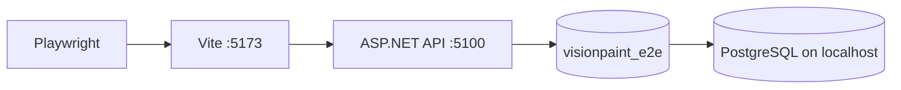
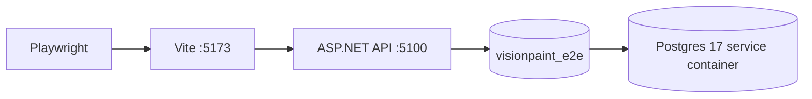

# VisionPaint frontend

Vue 3 + Vite + TypeScript + Tailwind CSS v4 + Pinia + Vue Router.

## Setup

```bash
cd frontend
npm install
npm run dev
```

## Environment

Optional `.env`:

```
VITE_API_URL=https://vision-paint-api.azurewebsites.net/api
```

## Design

UI behavior and routes: [../docs/design/ui-spec.md](../docs/design/ui-spec.md)

## Scripts

- `npm run dev` — local dev server (port 5173)
- `npm run build` — production build to `dist/`
- `npm run preview` — preview production build
- `npm run test:e2e` — Playwright smoke tests (installs Chromium on `npm install`, prepares DB, starts API + Vite, runs browser flow)
- `npm run test:e2e:prepare-db` — reset `visionpaint_e2e` and apply migrations only (same script CI uses)

### E2E architecture

Playwright drives the **browser UI**. The UI calls the **local API**, which reads/writes a **disposable Postgres database** named `visionpaint_e2e`. Tests do not hit Supabase or production.

**Local** (your machine):



**GitHub Actions** (same flow, different Postgres host):



Before each run, `tests/e2e/prepare-database.ts` drops/recreates `visionpaint_e2e` and applies `database/migrations/*.sql`. Local and CI both call this via Playwright `globalSetup` (or `npm run test:e2e:prepare-db`).

### E2E prerequisites (local)

1. **PostgreSQL 17** installed and running on your machine (`localhost:5432`).
2. Copy `backend.Tests/.env.example` to `backend.Tests/.env` and set `VISIONPAINT_TEST_PGADMIN` to an admin connection (must be able to create databases), for example:

   ```
   VISIONPAINT_TEST_PGADMIN=Host=127.0.0.1;Port=5432;Username=postgres;Password=your-password;Database=postgres
   ```

3. From `frontend/`: `npm install` then `npm run test:e2e`.

`npm run test:e2e` is self-contained: it does **not** use your Supabase connection from `appsettings.local.json`. Stop anything else bound to ports **5100** and **5173** unless you intend to reuse servers (see below).

### E2E env overrides

| Variable | Purpose |
|----------|---------|
| `VISIONPAINT_TEST_PGADMIN` | Admin Postgres connection (local `.env` or set in CI workflow) |
| `PLAYWRIGHT_DB_CONNECTION` | Override app connection string for the API |
| `PLAYWRIGHT_SKIP_WEBSERVER` | `true` — API and Vite already running |
| `PLAYWRIGHT_SKIP_DB_SETUP` | `true` — skip drop/create/migrate (DB already prepared) |
| `PLAYWRIGHT_REUSE_SERVERS` | `true` — reuse processes on 5100/5173 (off by default; a dev API on 5100 will break bootstrap) |

Deployed via Firebase Hosting (`firebase.json`).
